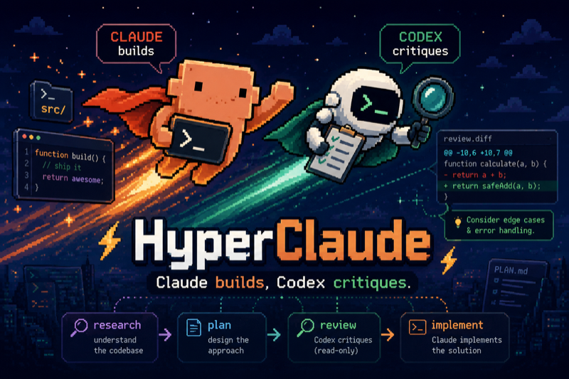

# HyperClaude

> Push Claude Code beyond stock. Claude builds, Codex critiques.
> A gated research → plan → review → ship pipeline.

> 🚧 **Early alpha.** v0.10 is implemented and dogfooded daily. Layout, naming, and APIs may change between minor versions until v1.0.



## Why

A Claude Code plugin built around a deliberate division of labor between two AI coding agents:

- **Claude** implements — planning, coding, subagents, agent teams
- **Codex** reviews — pre-implementation research, plan critique, code review, documentation accuracy review

Thesis: **Claude is the builder, Codex is the critic.** You get better software with a smarter cost split.

## The cycle

```
            ┌─ refine ─┐            ┌──── fix ───┐            ┌──── fix ───┐
            ▼          │            ▼            │            ▼            │
research → plan → plan-review → implement → code-review → docs-sync → docs-review → ship
   │         │         │            │            │            │            │           │
 Codex     Claude    Codex    Claude(+agents)  Codex      Claude       Codex        user
```

Each step has one trigger and one artifact under `.hyperclaude/`. Skip any step a small change doesn't need — only `code-review` is non-negotiable for behavioral changes. See [docs/workflow.md](docs/workflow.md) for triggers, skip rules, and `--resume`.

## Architecture (v0.10)

```
                           User in Claude Code
                                   │
         ┌──────────────────────────┼───────────────────────────┐
         │                          │                           │
      Commands                   Skills                      Agents
         │                          │                           │
   hyper-setup            Codex gates                  Claude impl arm
   (prerequisite          (research /                  (planner /
   doctor; no             plan-review /                implementer /
   Codex spawn)           code-review /                verifier /
                          docs-review)                 documenter)
                               +
                          Claude orch
                          (plan /
                          docs-sync /
                          implement /
                          tdd / debug)
                                   │
                                 Hooks
                                   │
                            SessionStart
                             reminder
                            (workflow
                            router +
                            snapshot)
                                   │
                              codex-bridge.mjs
                          (only Codex-spawning code;
                           always read-only sandbox)
                                   │
                          ┌────────▼────────┐
                          │  .hyperclaude/  │
                          │   research/     │
                          │   plans/        │
                          │   plan-reviews/ │
                          │   code-reviews/ │
                          │   docs-reviews/ │
                          └─────────────────┘
```

Four layers:

1. **Commands** (`commands/`) — explicitly-invoked slash commands, distinct from description-triggered skills. Auto-discovered; no manifest entry. Currently one: `hyper-setup` (`/hyperclaude:hyper-setup`) — a local prerequisite doctor that never spawns Codex or agents.
2. **Skills** (`skills/`) — Codex gates (`hyper-research`, `hyper-plan-review`, `hyper-code-review`, `hyper-docs-review`) + Claude orchestrators (`hyper-plan`, `hyper-docs-sync`) + autonomous plan-revise loop (`hyper-plan-loop`, requires `CLAUDE_CODE_EXPERIMENTAL_AGENT_TEAMS=1`) + plan execution (`hyper-implement`) + implementation discipline (`hyper-tdd`, `hyper-debug`). All surface via Claude Code's description-triggered dispatch.
3. **Agents** (`agents/`) — Claude implementation arm (`planner`, `implementer`, `verifier`, `documenter`).
4. **Hooks** (`hooks/`) — SessionStart reminder (workflow router + `.hyperclaude/` snapshot footer).

When hyperclaude invokes `codex exec` (research, plan-review, docs-review), it always passes `--sandbox read-only`. When it invokes `codex exec review` (code review) or `codex exec resume` (`--resume` for plan-review / code-review / docs-review), neither subcommand exposes `--sandbox`, so the bridge passes `-c sandbox_mode=read-only` as a config override. In every mode, Codex's role in hyperclaude is *critic*, never *editor*. Every Codex invocation (all modes, fresh and resume) also runs with live web search enabled (`codex --search …`), so Codex may fetch external content while it reviews your code or docs — this does NOT relax the read-only sandbox.

External dependencies: Claude Code plugin runtime, `codex-cli >= 0.130.0`, Node 18+, and `git` (for diff-backed gates: code-review, docs-sync, docs-review with `--diff-base`). Nothing else (no npm bin, no tmux, no MCP servers).

## Conventions

- **Plan files** — when Claude writes a plan that you intend to review, save it under `.hyperclaude/plans/<YYYYMMDD-HHMM>-<slug>.md`. `/hyperclaude:hyper-plan-review` auto-discovers the most recent file there. You can also pass an explicit path: `/hyperclaude:hyper-plan-review path/to/plan.md`.
- **Artifacts** — `.hyperclaude/{research,plans,plan-reviews,code-reviews,docs-reviews}/` is created in the consumer project. Add `.hyperclaude/` to your `.gitignore` if you don't want artifacts committed.
- **Slug** — lowercase kebab-case, ≤5 words, ASCII only. Same slug links a research → plan → plan-review trio.

## Documentation

- [docs/architecture.md](docs/architecture.md) — layers, bridge details, plugin layout, output contract.
- [docs/gates-and-agents.md](docs/gates-and-agents.md) — what each skill and agent does, when to invoke.
- [docs/workflow.md](docs/workflow.md) — the end-to-end research → ship cycle this plugin is built around.
- [docs/development.md](docs/development.md) — local install, tests, release flow.
- [docs/decisions.md](docs/decisions.md) — non-obvious "why" notes and active deferrals (UserPromptSubmit hook, recursive docs-dir, etc.).

Per-feature plans for later versions live in `.hyperclaude/plans/` (gitignored — working artifacts, lifted into the docs above when load-bearing).

## Quick start

1. Install the plugin via Claude Code:

   ```bash
   /plugin marketplace add zeikar/hyperclaude
   /plugin install hyperclaude
   ```

2. Verify prerequisites with the built-in doctor command:

   ```text
   /hyperclaude:hyper-setup
   ```

   This checks Node 18+, codex-cli >= 0.130.0, git, and (optionally) the `CLAUDE_CODE_EXPERIMENTAL_AGENT_TEAMS` env var needed by `hyper-plan-loop`. Report-only; nothing is installed automatically.

3. In a Claude Code session inside any project, try a gate:

   ```text
   /hyperclaude:hyper-research add OAuth login to the API
   ```

   The first invocation creates `.hyperclaude/research/<timestamp>-add-oauth-login-to-the.md` with Codex's prior-art / pitfalls / recommendations. Read it; plan accordingly.

4. After Claude writes a plan to `.hyperclaude/plans/<slug>.md`, critique it:

   ```text
   /hyperclaude:hyper-plan-review
   ```

   After fixing what step 4 flagged, re-run `/hyperclaude:hyper-plan-review --resume` to get an updated critique without re-uploading the plan (token-cheap iterative loop).

   **Autonomous alternative:** `/hyperclaude:hyper-plan-loop` runs the full plan-write → review → revise cycle in one gesture (requires `CLAUDE_CODE_EXPERIMENTAL_AGENT_TEAMS=1`). `hyper-plan` + `hyper-plan-review` remain available for manual use.

5. After implementing, review the code changes:

   ```text
   /hyperclaude:hyper-code-review
   ```

   - Default: reviews the current branch vs `main`.
   - For working-tree changes (staged + unstaged + untracked): `/hyperclaude:hyper-code-review uncommitted`
   - For a specific commit: `/hyperclaude:hyper-code-review <commit-sha>`

6. After coding, sync docs to reflect your changes:

   ```text
   /hyperclaude:hyper-docs-sync uncommitted
   ```

   The skill reads a `Code | Docs` mapping table from your `CLAUDE.md` or `AGENTS.md` (falls back to heuristic if no table is present), identifies which docs need updating, and dispatches targeted doc updates. A summary is reported on completion.

7. Gate the updated docs with a Codex accuracy review:

   ```text
   /hyperclaude:hyper-docs-review
   ```

   - Default: reviews top-level `.md` files in `docs/` (the commentarium convention).
   - For a single file: `/hyperclaude:hyper-docs-review README.md`
   - For a specific subdir: `/hyperclaude:hyper-docs-review docs/api/`
   - With code-diff context: `/hyperclaude:hyper-docs-review README.md --diff-base main`

   Writes a review file under `.hyperclaude/docs-reviews/` with valid frontmatter and a Codex-generated accuracy assessment. Fix any accuracy issues before merging.

   After fixing documentation issues, re-run `/hyperclaude:hyper-docs-review --resume` to get an updated assessment without re-uploading (token-cheap iterative loop).

## Development

```bash
node --test tests/*.mjs            # unit tests for the bridge and setup-doctor
bash scripts/test/smoke.sh         # acceptance smoke checks
```

Zero npm dependencies. Node 18+ stdlib only.

## Status

**v0.10 (alpha).** Use at your own risk; expect breaking changes between minor versions until v1.0.

## Acknowledgements

Structural inspiration from:

- [superpowers](https://github.com/obra/superpowers) by Jesse Vincent
- [oh-my-claudecode](https://github.com/Yeachan-Heo/oh-my-claudecode) by Yeachan Heo

No code ported from either; references only.

## License

[MIT](LICENSE)
